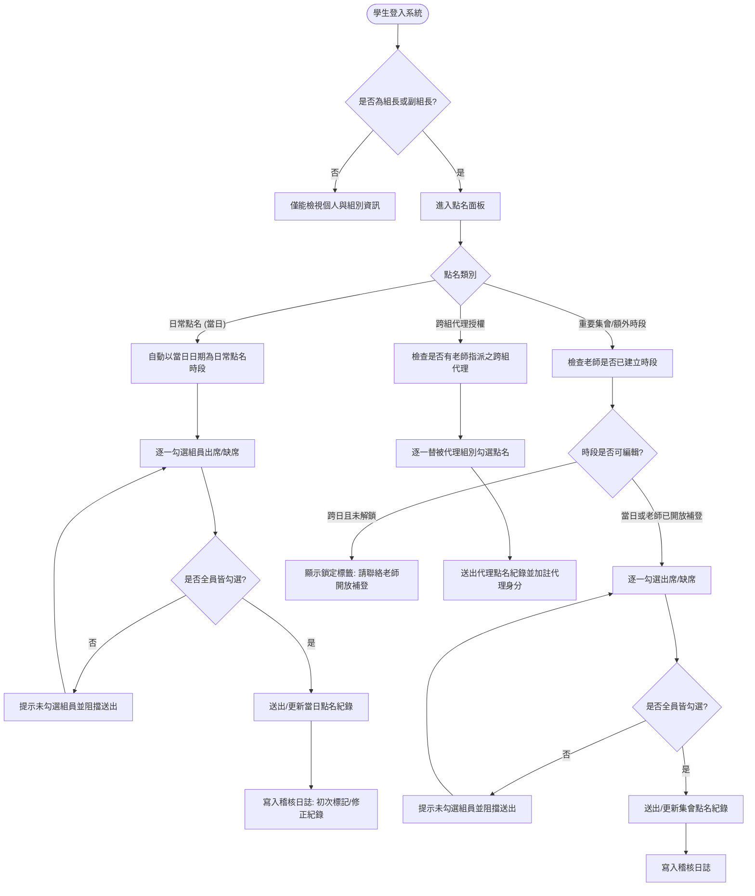

# 點名管理系統架構與設計指南 (Roll Call & Attendance System Design)

本文件彙整本專案中經過實務驗證的**點名管理系統（Attendance System）**之完整架構、資料庫綱要（Schema）、業務邏輯規則、前後端 API 規格與 UI/UX 實作指南。旨在提供清楚、模組化且易於移植的設計藍圖，方便直接複製並導入至其他教學或專案管理系統中。

---

## 1. 系統架構與核心設計哲學

### 1.1 核心設計痛點與解決方案

| 教學現實現況 / 痛點 | 本系統之對應機制 | 設計效益 |
| :--- | :--- | :--- |
| **痛點 1：日常上課點名手續繁瑣**<br>每次上課老師都要先在後台新增時段，容易遺忘或造成操作負擔。 | **日常點名免建時段（自動當天推導）**<br>系統自動以當天日期識別 `daily-YYYY-MM-DD`。組長／副組長登入即可直接點名，無需老師事先建置。 | 零前置作業、組長即開即點、順暢無阻。 |
| **痛點 2：特殊集會／期末專題報告**<br>系週會、專案進度簡報、校外教學需要加註特別名稱或多次點名。 | **重要集會額外點名時段**<br>老師可在後台自訂日期、節次時段與專案名稱（如「期末專案評審」），開放組長額外點名。 | 彈性支援多時段與特定活動考核。 |
| **痛點 3：組長虛報「全員到齊」**<br>一鍵到齊按鈕容易讓組長不用心確認，導致出缺席紀錄失真。 | **嚴格禁用全員到齊一鍵按鈕**<br>強制組長／副組長逐一為每位組員勾選「出席」或「缺席」單選鈕，送出前若有遺漏立即阻擋。 | 確保確實核對，提升點名數據真實性。 |
| **痛點 4：事後補改或串通改紀錄**<br>組長事後可能因人情關係私下將缺席改為出席。 | **當日自由更新，跨日強制鎖定**<br>當天可隨時修正；一旦過渡至隔日系統自動鎖定唯讀。超過當日必須由老師於後台審核解鎖。 | 兼顧當日容錯彈性與跨日防弊安全性。 |
| **痛點 5：組長與副組長均缺席**<br>該組無人可執行點名，導致全組進度空轉。 | **跨組代理點名機制 (Delegation)**<br>老師後台能即時看見組長缺席，並指派鄰近或指定組別之組長／副組長跨組代點。 | 排除單點故障，解決組長缺席無人點名之困境。 |
| **痛點 6：學生忘記點名需補登**<br>因公假或不可抗力需事後補登，但不應永久門戶大開。 | **時效性精準補登解鎖 (Teacher Unlock)**<br>老師可針對「指定組別」或「全班」，開放補登並設定「補登截止時間」（如開放 2 小時）。 | 權限收放精確，逾時自動再次封閉。 |
| **痛點 7：多元背景學生／外籍生操作困擾**<br>介面語文不易理解造成操作錯誤。 | **三語標注（繁中／English／Tiếng Việt）**<br>介面標籤、提示文字、狀態標記與驗證訊息均具備中英越對照。 | 外籍學生無障礙操作，減少誤點。 |

---

## 2. 業務流程與狀態機 (State Machine)

### 2.1 點名生命週期流程圖



---

## 3. 資料庫結構設計 (Database Schema)

本設計使用關聯式資料庫（如 SQLite / Cloudflare D1 / PostgreSQL / MySQL 皆通用）。

### 3.1 點名時段表 (`attendance_sessions`)
記錄常規或特殊點名時段。日常點名於當天學生首次點名時自動寫入（或由老師在後台建立重要集會）。

```sql
CREATE TABLE IF NOT EXISTS attendance_sessions (
  id          TEXT NOT NULL,               -- 時段唯一鍵，例：'daily-2026-09-21' 或自建 ID
  course_id   TEXT NOT NULL,               -- 關聯課程或班級 ID
  date        TEXT NOT NULL,               -- 日期字串，格式 'YYYY-MM-DD'
  time_slot   TEXT NOT NULL DEFAULT '',    -- 節次或時段文字，例如「第3-4節」、「14:00-16:00」
  name        TEXT NOT NULL DEFAULT '',    -- 點名名稱，如「一般日常點名」、「期末專題評審」
  created_at  INTEGER NOT NULL,            -- 建立時間戳 (毫秒)
  PRIMARY KEY (course_id, id)
);

CREATE INDEX IF NOT EXISTS idx_attendance_sessions_course 
  ON attendance_sessions(course_id, date DESC);
```

### 3.2 點名明細紀錄表 (`attendance_records`)
儲存每個學生的出席紀錄。以 `(course_id, session_id, student_id)` 形成複合唯一鍵，支援反覆修正。

```sql
CREATE TABLE IF NOT EXISTS attendance_records (
  course_id      TEXT NOT NULL,
  session_id     TEXT NOT NULL,            -- 關聯 attendance_sessions.id
  student_id     TEXT NOT NULL,            -- 學號或學生唯一鍵
  group_id       TEXT NOT NULL DEFAULT '', -- 所屬組別 ID
  status         TEXT NOT NULL DEFAULT 'present', -- 'present'(出席) 或 'absent'(缺席)
  marked_by_id   TEXT NOT NULL DEFAULT '', -- 執行點名操作者學號 (組長/副組長/代理人)
  marked_by_name TEXT NOT NULL DEFAULT '', -- 執行點名操作者姓名
  created_at     INTEGER NOT NULL DEFAULT 0, -- 首次點名時間戳
  updated_at     INTEGER NOT NULL,           -- 最後更新/修正時間戳
  PRIMARY KEY (course_id, session_id, student_id)
);

CREATE INDEX IF NOT EXISTS idx_attendance_records_session 
  ON attendance_records(course_id, session_id);
```

### 3.3 補登權限解鎖表 (`attendance_unlocks`)
老師針對超過當天之舊時段開放補登。可指定特定組別或全體組別（`group_id=''`），並可附帶截止時間。

```sql
CREATE TABLE IF NOT EXISTS attendance_unlocks (
  course_id  TEXT NOT NULL,
  session_id TEXT NOT NULL,
  group_id   TEXT NOT NULL DEFAULT '',     -- 空白代表該時段之「全部組別」皆開放補登
  deadline   TEXT NOT NULL DEFAULT '',     -- 補登截止時間 (ISO 字串)，空白代表不限期
  created_at INTEGER NOT NULL,
  PRIMARY KEY (course_id, session_id, group_id)
);
```

### 3.4 跨組代理授權表 (`attendance_delegates`)
當某組組長與副組長皆缺席時，老師指派他組幹部代理點名。

```sql
CREATE TABLE IF NOT EXISTS attendance_delegates (
  course_id     TEXT NOT NULL,
  session_id    TEXT NOT NULL,
  group_id      TEXT NOT NULL,             -- 被代理點名的組別 ID
  delegate_id   TEXT NOT NULL,             -- 被授權代理之學生學號（需為組長或副組長）
  delegate_name TEXT NOT NULL DEFAULT '',  -- 代理人姓名
  created_at    INTEGER NOT NULL,
  PRIMARY KEY (course_id, session_id, group_id, delegate_id)
);
```

### 3.5 點名稽核與活動日誌表 (`activity_logs`)
完整留存誰在何時標記或修正了誰的出缺席。

```sql
CREATE TABLE IF NOT EXISTS activity_logs (
  id            INTEGER PRIMARY KEY AUTOINCREMENT,
  course_id     TEXT NOT NULL,
  group_id      TEXT NOT NULL DEFAULT '',
  group_name    TEXT NOT NULL DEFAULT '',
  operator_role TEXT NOT NULL DEFAULT '',  -- 'leader' | 'vice' | 'teacher'
  operator_id   TEXT NOT NULL DEFAULT '',
  operator_name TEXT NOT NULL DEFAULT '',
  action_type   TEXT NOT NULL DEFAULT '',  -- 'attendance-mark' | 'attendance-correct' | 'attendance-unlock' | 'attendance-delegate'
  target_id     TEXT NOT NULL DEFAULT '',
  target_name   TEXT NOT NULL DEFAULT '',
  detail        TEXT NOT NULL DEFAULT '',
  created_at    INTEGER NOT NULL
);

CREATE INDEX IF NOT EXISTS idx_logs_course ON activity_logs(course_id, created_at DESC);
```

---

## 4. 權限判斷核心邏輯 (Core Logic & Permissions)

### 4.1 點名時段分類判定
```javascript
// 取得當前本地 YYYY-MM-DD
function todayDateStr() {
  const d = new Date();
  const y = d.getFullYear();
  const m = String(d.getMonth() + 1).padStart(2, '0');
  const day = String(d.getDate()).padStart(2, '0');
  return `${y}-${m}-${day}`;
}

// 判斷時段是否為日常點名
function isDailySession(session) {
  if (!session) return false;
  if (session.isDaily) return true;
  if (session.id && String(session.id).startsWith('daily-')) return true;
  if (session.name && (session.name.includes('日常點名') || session.name.includes('Daily'))) return true;
  return false;
}
```

### 4.2 編輯權限檢核（含當日判定與補登檢查）
```javascript
// 判斷時段目前是否處於可編輯狀態
function isAttendanceEditable(session, unlocks = [], groupId = '') {
  if (!session) return false;
  
  // 1. 若為當天日期，組長/副組長皆可自由填寫或修正
  if (session.date === todayDateStr()) {
    return true;
  }
  
  // 2. 超過當天，檢查老師是否開放補登權限
  const now = Date.now();
  const match = unlocks.find(u => {
    if (u.sessionId !== session.id) return false;
    // 檢查組別：符合特定組別 或 開放給全組別 ('')
    const groupMatch = (!u.groupId || u.groupId === groupId);
    if (!groupMatch) return false;
    // 檢查截止時間
    if (!u.deadline) return true; // 不限期
    return new Date(u.deadline).getTime() > now;
  });

  return !!match;
}
```

### 4.3 點名執行身分檢核
送出點名時，後端必須嚴格驗證下列條件之一：
1. 操作者為該組之**組長** (`isLeader === true`) 或 **副組長** (`isVice === true`)。
2. 操作者被老師授權為**跨組代理人**（在 `attendance_delegates` 中有紀錄）。
3. 操作者為授課老師（若系統允許老師代點）。

---

## 5. API 介面規格 (API Specification)

所有請求均採用 JSON 格式，回應包含成功或錯誤訊息。

### 5.1 學生端：送出／更新點名紀錄 (`mark-attendance`)
- **發起者**：組長、副組長、或跨組代理人。
- **Payload**：
```json
{
  "action": "mark-attendance",
  "courseId": "c_web_2026",
  "sessionId": "daily-2026-09-21",
  "groupId": "g_team1",
  "records": [
    { "studentId": "S101", "status": "present" },
    { "studentId": "S102", "status": "absent" },
    { "studentId": "S103", "status": "present" }
  ]
}
```
- **後端處置**：
  1. 檢核身分：操作者是否為本組組長/副組長，或具備該時段代理授權。
  2. 檢核時效：當日允許編輯；跨日則確認是否有有效 `attendance_unlocks`。
  3. 若該時段尚未在資料庫中（例如日常點名第一次送出），自動以 `INSERT OR IGNORE` 補進 `attendance_sessions`。
  4. 比對舊紀錄：
     - 若為全新點名：寫入 `created_at = now, updated_at = now`，記日誌 `attendance-mark`。
     - 若為修改：保留原 `created_at`，更新 `updated_at = now`，記日誌 `attendance-correct`（註明原本狀態與修改後狀態）。

---

### 5.2 教師端：建立或編輯特殊點名時段 (`teacher:save-attendance-session`)
- **Payload**：
```json
{
  "action": "teacher:save-attendance-session",
  "courseId": "c_web_2026",
  "id": "as_final_review",   // 新增時為空或留 null，編輯時帶入舊 ID
  "date": "2026-10-15",
  "timeSlot": "第5-6節",
  "name": "期末專題期中進度評審"
}
```

---

### 5.3 教師端：刪除點名時段 (`teacher:del-attendance-session`)
- **Payload**：
```json
{
  "action": "teacher:del-attendance-session",
  "courseId": "c_web_2026",
  "sessionId": "as_final_review"
}
```
- **級聯處置**：以事務（Transaction / Batch）同時刪除該時段下的所有 `attendance_records`、`attendance_unlocks` 與 `attendance_delegates`。

---

### 5.4 教師端：開放／關閉補登權限 (`teacher:set-attendance-unlock`)
- **Payload**：
```json
{
  "action": "teacher:set-attendance-unlock",
  "courseId": "c_web_2026",
  "sessionId": "daily-2026-09-14",
  "groupId": "g_team2",             // 留空字串 "" 代表全班所有組別
  "allow": true,                    // true=開放補登, false=關閉
  "deadline": "2026-09-22T18:00"     // 可選，補登截止時間
}
```

---

### 5.5 教師端：指派／撤銷跨組代理點名 (`teacher:set-attendance-delegate`)
- **Payload**：
```json
{
  "action": "teacher:set-attendance-delegate",
  "courseId": "c_web_2026",
  "sessionId": "daily-2026-09-21",
  "groupId": "g_team1",             // 被代理之組別
  "delegateId": "S201",             // 代理人學號（需為他組組長或副組長）
  "allow": true                     // true=授權, false=移除授權
}
```

---

## 6. 前端 UI/UX 設計模式

### 6.1 組長／副組長點名操作介面 (Leader View)

#### A. 介面三大分區佈局
1. **今日一般日常點名卡片 (Daily Attendance Card)**
   - 藍色醒目框體，標記今日日期。
   - 狀態標籤：
     - `⏳ 今日尚未點名 Not Yet Taken`
     - `⚠️ 點名進行中 In progress (已確認 X/Y 人)`
     - `✅ 今日點名已完成 Completed (出席 A / 缺席 B)`
   - 組員清單以 Row 呈現，每個組員右側提供兩顆 Radio 按鈕：
     - `[Radio] 出席 Present（Có mặt）`
     - `[Radio] 缺席 Absent（Vắng mặt）`
   - 若尚未勾選，組員姓名旁顯示紅色或黃色警示標籤 `尚未確認 Unconfirmed`。
   - 底部送出按鈕：`📋 送出今日日常點名`（送出過則變更為 `🔄 重新更新今日日常點名`）。

2. **重要集會與額外點名卡片 (Special Sessions Card)**
   - 橙色警示框體。
   - 僅當老師有新增特殊時段且當前開放編輯時顯示。
   - 包含時段名稱（如「期末專題評審」）、日期與節次。

3. **歷史點名紀錄區塊 (Past Records Section)**
   - 灰色收合或唯讀清單。
   - 每一筆紀錄標注時段名稱、出席/缺席名單。
   - 標示 `已鎖定 Locked（Đã khóa）`，並註記 `如需補登請聯絡老師開放權限 Ask teacher to unlock`。

4. **跨組代理點名專區 (Delegate Card)**
   - 紫色邊框專屬卡片。
   - 僅當該組長被老師授權代理另一組時出現，清楚說明「老師已授權您代理某組點名（因該組組長／副組長皆未到）」。

#### B. 送出驗證防護（杜絕遺漏與全員到齊捷徑）
```javascript
// 前端表單送出攔截
function onAttendanceSubmit(event, mates) {
  event.preventDefault();
  const form = event.target;
  const formData = new FormData(form);
  
  // 檢查是否有未勾選的組員
  const missing = mates.filter(m => !formData.get(`att_${m.id}`));
  if (missing.length > 0) {
    const names = missing.map(m => `${m.name} (${m.id})`).join('、');
    alert(
      `尚有 ${missing.length} 位組員尚未確認出缺席，請逐一確認每位組員是否出席或缺席：\n${names}\n\n` +
      `Some members have not been verified. Please check each member one by one.\n` +
      `Còn ${missing.length} thành viên chưa xác nhận. Vui lòng xác nhận riêng cho từng người.`
    );
    return; // 阻擋送出
  }

  // 組裝紀錄 payload 並送出
  const records = mates.map(m => ({
    studentId: m.id,
    status: formData.get(`att_${m.id}`)
  }));
  sendMarkAttendanceApi({ sessionId: form.dataset.session, records });
}
```

---

### 6.2 教師端點名儀表板 (Teacher Dashboard)

教師儀表板主要分為四個監控與操作看板：

```
+-------------------------------------------------------------------------+
|  📋 點名管理儀表板 (Teacher Attendance Management)                       |
+-------------------------------------------------------------------------+
|  1. 點名時段設定與補登授權 (Session List & Unlock Management)            |
|     - 新增/編輯特殊點名時段表單 (日期、節次、名稱)                         |
|     - 時段表格 (含 [編輯] [刪除] [開放全部補登] [指定組別補登選單])         |
+-------------------------------------------------------------------------+
|  2. 當日各組點名進度與代理指派 (Progress & Delegation)                     |
|     - 下拉選擇欲監控時段                                                  |
|     - 表格列出：[組別] [完成進度: 3/4] [未被點名之組員(特別標示幹部)]     |
|     - 若發現該組組長與副組長缺席 -> 下拉選單指派【跨組代理人】             |
+-------------------------------------------------------------------------+
|  3. 每日各組缺席紀錄監控 (Daily Absence Roster)                           |
|     - 日期挑選器 (快速切換不同授課日)                                     |
|     - 顯示每組出席狀況，缺席者以紅色標籤標註，滑鼠停留顯示點名/修正時間戳   |
+-------------------------------------------------------------------------+
|  4. 全期缺席排行榜 (Absence Leaderboard)                                 |
|     - 快速統計累計缺席最多次之學生，及早進行學習預警或關懷輔導              |
+-------------------------------------------------------------------------+
```

---

## 7. 移植其他專案之逐步執行指南 (Migration Checklist)

如果您要在另一個專案（例如以 Node.js / Express / Next.js / Python FastAPI 開發之系統）中導入本點名設計，請依下列步驟進行：

### 步驟 1：建立資料庫表格
- 將第 3 節的 4 個資料表（`attendance_sessions`, `attendance_records`, `attendance_unlocks`, `attendance_delegates`）以及日誌表移植至目標資料庫。

### 步驟 2：後端 API 與權限中介層 (Middleware)
- 實作身分判斷：辨識請求者是否為組長、副組長或被指派之代理人。
- 實作日常點名自動化：若接收到 `sessionId === 'daily-YYYY-MM-DD'` 且為當日，自動持久化至時段表。
- 實作防弊鎖定：檢查 `session.date === todayDateStr()` 或 `attendance_unlocks` 是否有效，逾期拒絕寫入。

### 步驟 3：前端組長操作元件 (Client Component)
- 繪製組員名單，每人配置 `present` / `absent` Radio 按鈕。
- **嚴格不提供「全員出席一鍵全選」**，強制作答驗證。
- 分離「今日日常點名」、「重要集會」與「歷史唯讀紀錄」。

### 步驟 4：教師管理面板
- 提供時段維護、補登解鎖、代理人指派與即時進度查看。
- 加入缺席統計與匯出報表功能（CSV / Excel）。

### 步驟 5：多語言國際化 (i18n)
- 若目標客群包含外籍生，將「出席」、「缺席」、「尚未確認」、「組長」、「副組長」等詞彙抽離為多語系字典或直接雙語/三語標注。

---

## 8. 總結

本套點名架構兼顧了**日常操作的極簡（無須預先建立時段即可點名）**與**考核管理的嚴謹（逐一確認無快捷、當日鎖定、跨組代理、稽核日誌）**。在維持低管理成本的同時，大幅提高課堂或專案出席數據的真實性與信賴度。
